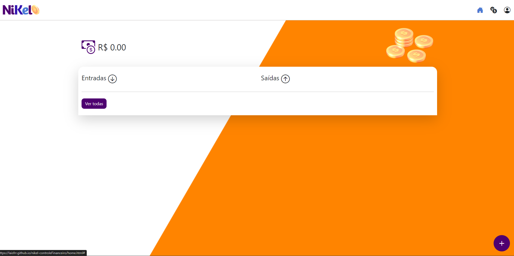
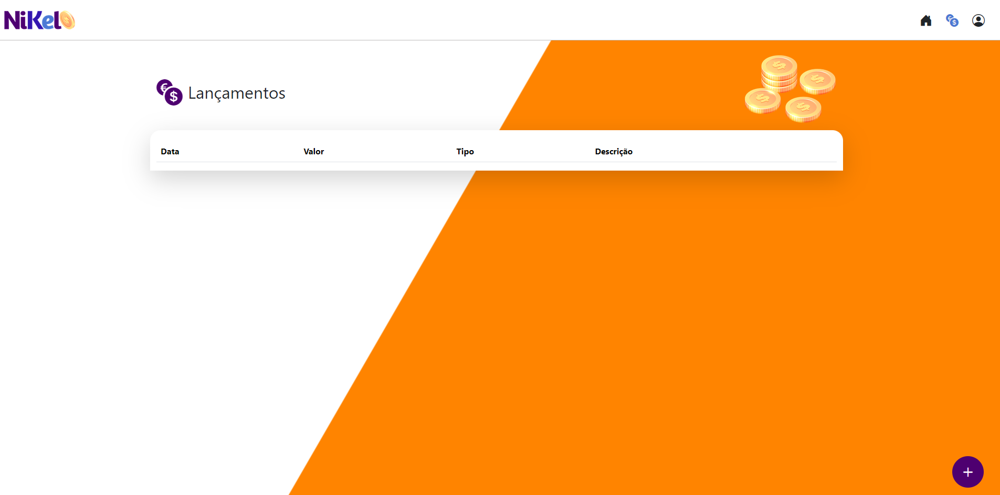

<h1 align="center">

 Nikel - Controle Financeiro

</h1>
  <h3>▶️ O QUE É?</h3> 
  
  - Desafio feito para o codaí da growdev.

  <h3>▶️ O QUE FAZ?</h3>

- Um sistema que calcula entrada e saída do seu dinheiro.

<h3>▶️ CARACTERISTICAS:</h3>

- Tela de Login.
- Criar usuário.
- armazenamento dos dados no localStorage.
- Tela de histórico geral.
- Possibilidade de permanecer logado.
- Botão para adicionar Lançamento na tela principal e de histórico.
- Alerta caso o saldo fique negativo.

<h3>▶️ TECNOLOGIAS:</h3>

- JavaScript
- HTML
- CSS
- BOOTSTRAP

<h1 align="center">🖼️ PREVIEW</h1>

<h4 >Tela de Login</h4>

<h4>Tela Home</h4>

<h4>Tela Histótico de Lançamentos</h4>

<h1 align="center">📱 VERSÃO MOBILE</h1>
<video controls src="./assets/images/nikel.mp4"></video>
